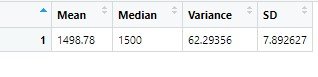
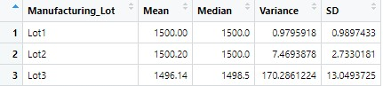
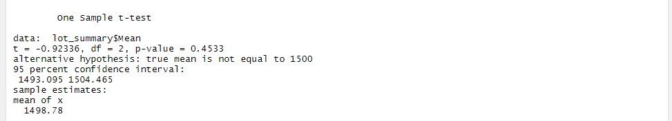
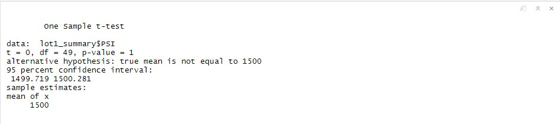
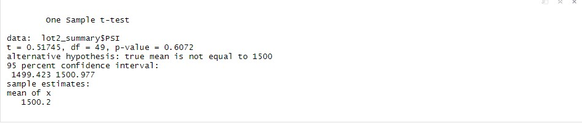
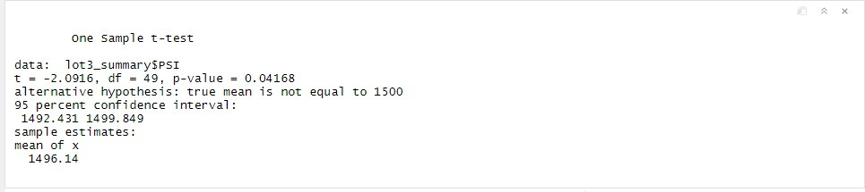

# MechaCar Statistical Analysis
***

## Linear Regression to Predict MPG

* Which variables/coefficients provided a non-random amount of variance to the mpg values in the dataset?

Vehicle Length and Ground Clearance provided a non-random variance to the mpg values. Their p-values were significantly less than .05. 

* Is the slope of the linear model considered to be zero? Why or why not?

The slope is not considered to be zero, the independent variables did appear to eefect the dependent variable causing a slope. 

* Does this linear model predict mpg of MechaCar prototypes effectively? Why or why not?

This particular linear model is considered to predict MPG of MechaCar prototypes. By observing the R-Squared value or .7149. we are able to determine that the model will predict the MPG of MechaCar prototypes correctly between 71-72% of the time.

***
## Summary Statistics on Suspension Coils

In this section of the analysis I took a look at the total summary of suspension coil dataset. After getting the total summary I split the data by the  three lot numbers, to create a lot summary. This allows for a further analysis is possible variation in manufacturing and other contributing factors.

#### Total Summary

#### Lot Summary

* The design specifications for the MechaCar suspension coils dictate that the variance of the suspension coils must not exceed 100 pounds per square inch. Does the current manufacturing data meet this design specification for all manufacturing lots in total and each lot individually? Why or why not?

At this time there is some discrepency with the data from Lot 3. As we can see the variance is more than double the total summary amount. At this time Lot 1 and Lot 2 meet the design specifications. The total summary is also within range. It would be best to use scrap Lot 3.

***

## T-Tests on Suspension Coils

***
## Study Design: MechaCar vs Competition

* What metric or metrics are you going to test?

* What is the null hypothesis or alternative hypothesis?

* What statistical test would you use to test the hypothesis? And why?

* What data is needed to run the statistical test?
